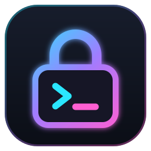
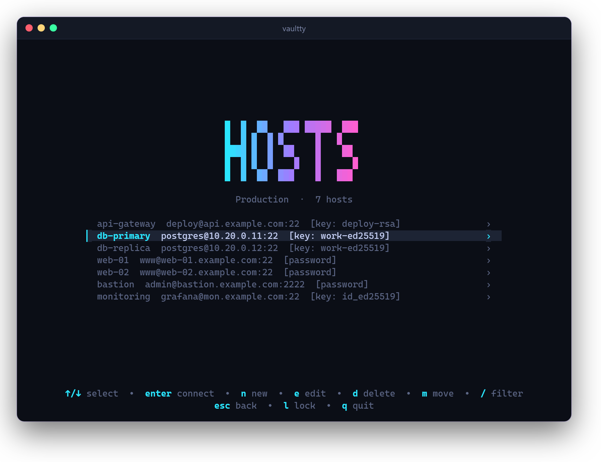
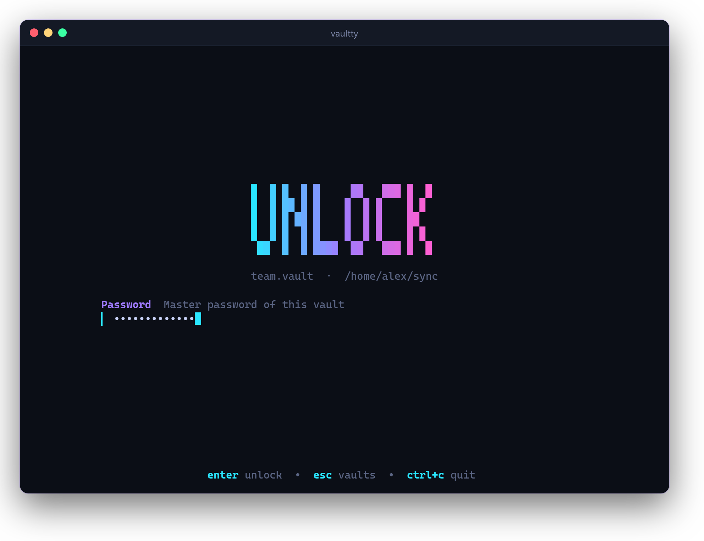
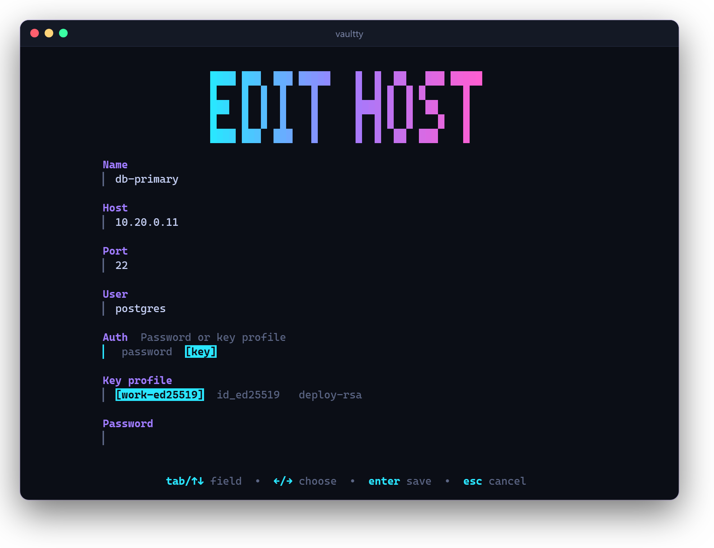
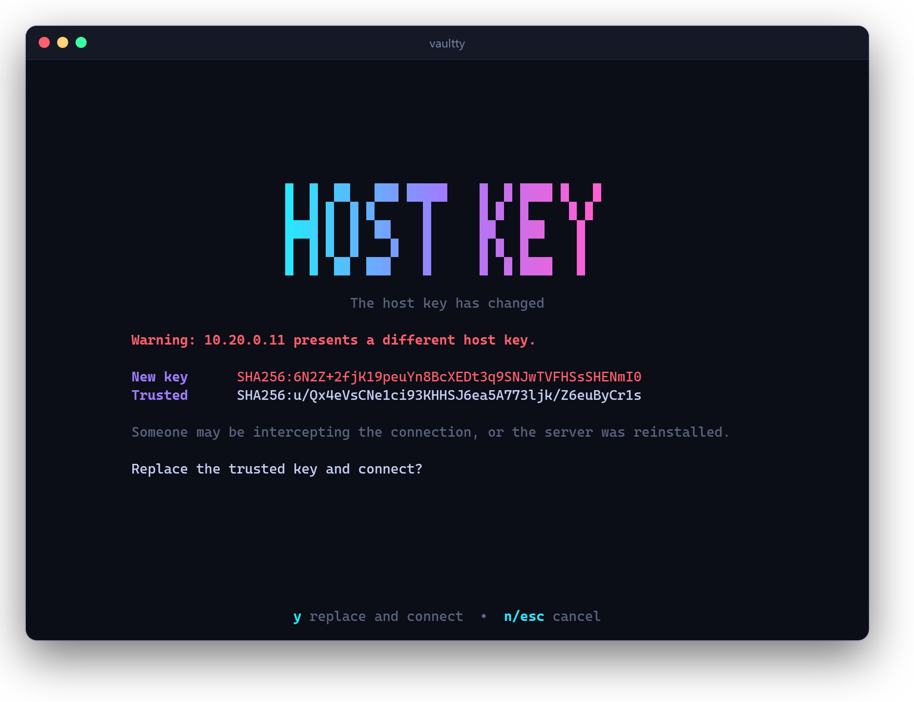

<p align="center">
  
</p>

<h1 align="center">vaultty</h1>

<p align="center">
  SSH hosts, passwords and keys in one encrypted file.<br>
  A terminal app for Windows, macOS and Linux.
</p>

<p align="center">
  <a href="https://github.com/maulai/vaultty/releases/latest"></a>
  <a href="https://github.com/maulai/vaultty/actions/workflows/ci.yml"></a>
  <a href="LICENSE"></a>
</p>

<p align="center">
  
</p>

## Highlights

- **One file.** Hosts, passwords, SSH keys and trusted host keys live in a single encrypted vault. Keep it on a USB stick or in a synced folder and use it on every machine.
- **Small.** Plain Go without cgo, one self-contained binary. The only direct dependencies are the [Charm](https://charm.sh) TUI stack and the Go team's `golang.org/x` modules.
- **Secure by default.** Argon2id and AES-256-GCM for the vault, host keys checked before any credential leaves your machine, modern SSH algorithms only.
- **Quick.** Folders, a filter and one key to connect. In a session, <kbd>ctrl</kbd>+<kbd>]</kbd> types the stored password, handy for sudo.
- **Pretty.** Neon colors and pixel banners, and it still works in an 80x24 window.

## Install

Download the archive for your system from the [latest release](https://github.com/maulai/vaultty/releases/latest), unpack it and put `vaultty` on your PATH.

Every release comes with `checksums.txt` and a signed build provenance. To check that an archive was built by this repository:

```sh
gh attestation verify vaultty_0.1.0_linux_amd64.tar.gz --repo maulai/vaultty
```

With Go 1.26 or newer:

```sh
go install github.com/maulai/vaultty@latest
```

The macOS binaries are not notarized. If Gatekeeper blocks the first start, run `xattr -d com.apple.quarantine vaultty` once.

## Usage

Run `vaultty`. The first start creates a vault. Pick a master password of at least 12 characters; a passphrase of several words works best.

Every screen shows its keys at the bottom. The main ones:

| Key | Action |
| --- | --- |
| <kbd>enter</kbd> | open folder, connect to host |
| <kbd>n</kbd> | new folder or host |
| <kbd>e</kbd> | edit host |
| <kbd>d</kbd> | delete |
| <kbd>m</kbd> | move host to another folder |
| <kbd>/</kbd> | filter hosts |
| <kbd>p</kbd> | key profiles |
| <kbd>l</kbd> | lock |
| <kbd>ctrl</kbd>+<kbd>]</kbd> | in a session: type the stored password |

A **key profile** is a private key that several hosts can share. It is either stored in the vault, so it travels with it, or read from a file such as `~/.ssh/id_ed25519` on each machine. Paths inside your home directory are saved as `~/...` and work on every system.

<p align="center">
  
  
</p>

### Configuration

vaultty remembers the vaults you opened in `config.json` in your user config directory: `~/.config/vaultty` on Linux, `~/Library/Application Support/vaultty` on macOS, `%AppData%\vaultty` on Windows.

`auto_lock_minutes` sets the inactivity timeout. 0 means the default of 3 minutes, a negative value turns auto lock off.

## Security

- The vault is encrypted with AES-256-GCM. The key is derived from the master password with Argon2id (256 MiB, 3 passes, 4 lanes) and a random salt. Every save uses a fresh nonce. Vaults with weaker parameters are upgraded on unlock.
- The master password is never stored. Locking, by hand or after 3 idle minutes, wipes the key and drops the decrypted data. Go cannot wipe every copy in memory, so remnants may stay until the memory is reused.
- An open SSH session counts as activity: the vault stays unlocked while it runs, and the idle time starts when it ends.
- Saves are atomic. If another program changed the vault file while it was open, vaultty refuses to overwrite it.
- The server's host key is checked before any password or key is sent. A new host shows its SHA256 fingerprint and waits for you. A changed key shows a red warning and is only replaced when you press <kbd>y</kbd>.
- Trusted host keys are stored inside the vault, so they move with it.
- SSH prefers the post-quantum hybrid key exchange `mlkem768x25519-sha256`. SHA-1 key exchange, SHA-1 MACs and `ssh-rsa` host key signatures are off.

<p align="center">
  
</p>

[SECURITY.md](SECURITY.md) describes the file format, the threat model and how to report a vulnerability.

### Not included

No ssh-agent, port forwarding, jump hosts or SFTP. vaultty opens interactive shells.

## Build

```sh
go build .
go test ./...
```

Releases are automated. Commits follow [Conventional Commits](https://www.conventionalcommits.org). [release-please](https://github.com/googleapis/release-please) keeps a release pull request up to date; merging it tags the version and [GoReleaser](https://goreleaser.com) builds and publishes the binaries.

## About

Most of the code in this repository was written by AI (Claude by Anthropic, through Claude Code) under human direction. Issues and pull requests are welcome.

## License

[MIT](LICENSE)
